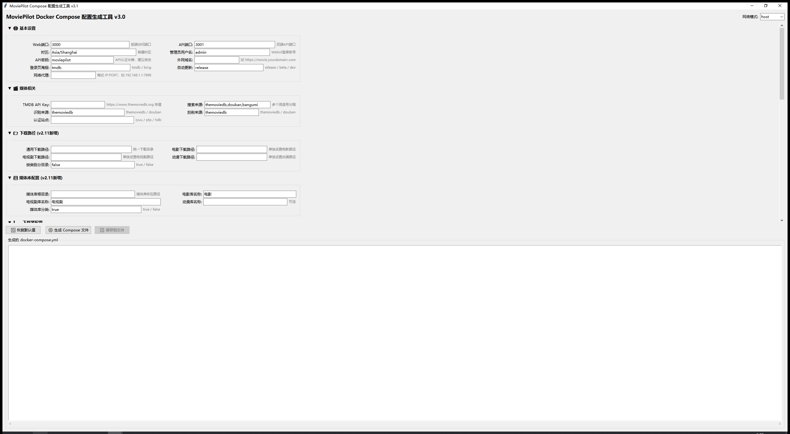
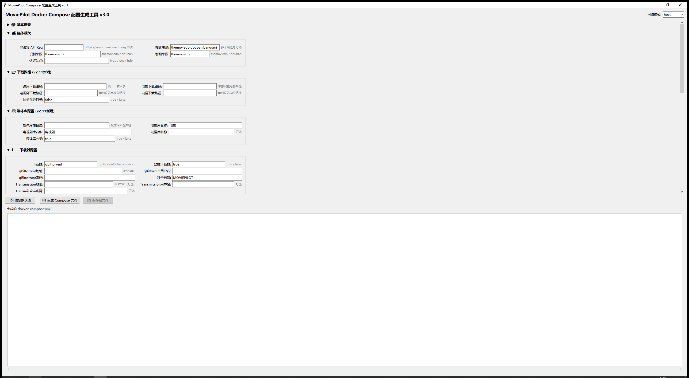
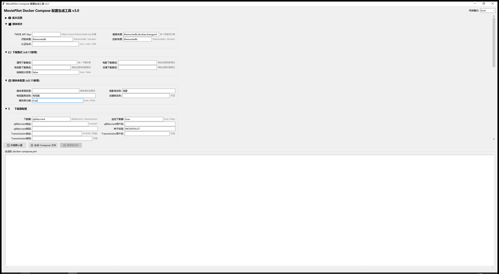
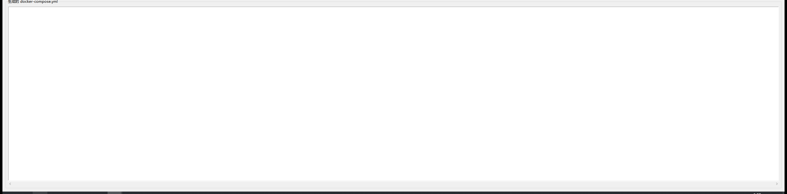

# mpcomposer v3.1
# MoviePilot Docker Compose 配置生成工具

## 📌 概述
基于 Python tkinter 的图形界面工具，用于快速生成 MoviePilot v2.11.0 的 Docker Compose 配置文件。

**v3.0 重大更新**：所有环境变量严格对应 MoviePilot `app/core/config.py` 源码，删除了旧版中虚构的变量（API_PORT、IYUU_SIGN 等），新增 v2.11.0 的下载路径管理、媒体库配置、CookieCloud 等模块。

**v3.1 更新**：修复 BT_BACKUP_DIR 注释问题、简化环境变量收集逻辑、卷映射默认路径改为飞牛 NAS 通用格式、镜像标签锁定 v2.11.0。







## ✨ 主要功能

### 10 个配置分组（手风琴折叠）

| 分组 | 配置项数 | 说明 |
|------|---------|------|
| 🌐 基本设置 | 9 | 端口、管理员、域名、代理 |
| 🎬 媒体相关 | 5 | TMDB、搜索、刮削来源 |
| 📁 下载路径 (v2.11新增) | 5 | 按类型分别配置下载目录 |
| 📚 媒体库配置 (v2.11新增) | 5 | 媒体库根目录和分类 |
| ⬇️ 下载器配置 | 9 | qBittorrent / Transmission |
| 🖥️ 媒体服务器 | 7 | Emby / Jellyfin / Plex |
| 📢 通知渠道 | 6 | WebPush / 微信 / Telegram |
| ☁️ CookieCloud | 4 | Cookie 同步 |
| 🔧 高级选项 | 8 | GitHub、字幕、转移方式 |
| 🐳 Docker安全上下文 | 3 | PUID、PGID、UMASK |

### 网络模式
- **Host** 模式（默认）：容器共享宿主机网络
- **Bridge** 模式：端口映射 3000(Web) / 3001(API)

### 卷映射
- 配置目录 → `/config`
- 媒体目录 → `/media`
- 下载目录 → `/downloads`
- BT 备份 → `/BT_backup`
- Docker Socket → `/var/run/docker.sock` (只读)

## 🚀 使用方式

```bash
python3 run
# 或
python3 run.py
```

1. 选择网络模式
2. 展开分组，填写配置项
3. 点击「生成 Compose 文件」
4. 点击「保存到文件」或直接复制

## 📦 依赖

- Python 3.8+
- tkinter（Python 自带）

## 📄 许可证

MIT
